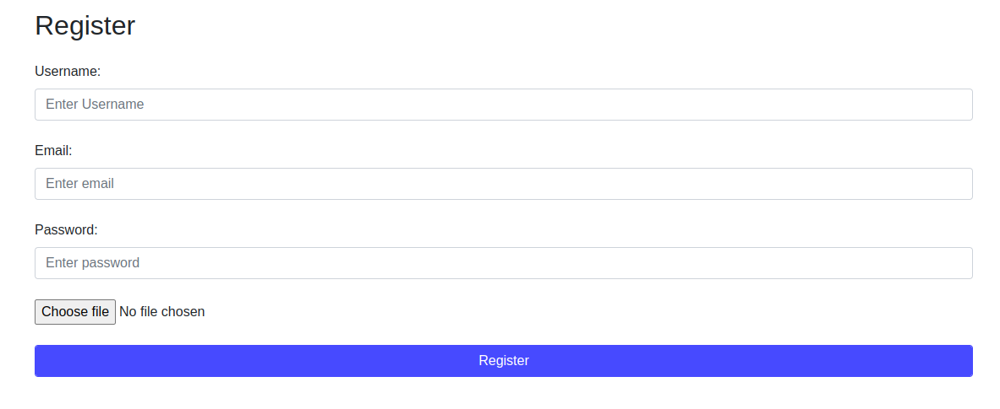
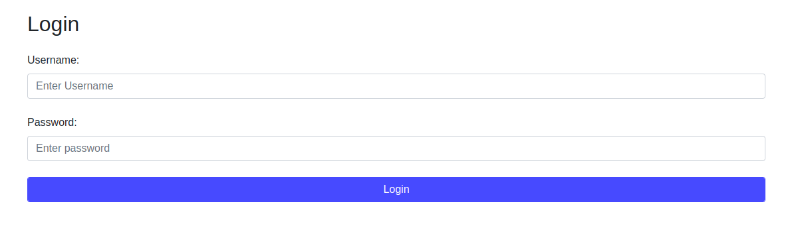

# NEC Software Solutions

## About
This repo demonstrates the registration page and the login page developed in core PHP.  More emphasis has been given to PHP code.

The repo uses Bootstrap CSS for styling. It uses CDN for Bootstrap CSS. Therefore, you will need an internet connection to view the form with stylings. When the registration form or the login form is submitted, the validation is performed on the server side and the form is submitted.  If there is an error in the input value, then the error message is displayed for the respective field.

The repo demonstrates the use of a .htaccess file. To query into the database, the PHP code uses the prepared statement for SQL injection protection.

## Steps
1. Open the config.php file.
2. Replace the constant values with your values.
3. DOMAIN_SUB_PART - If your website's home URL is https://yourdomain.com/en, then you must provide the 'en' in this constant value. If your website's home URL is https://yourdomain.com/, then you must enter an empty string like this ''.
4. DB_HOST - Database host.
5. DB_USERNAME - Database username.
6. DB_PASSWORD - Database password.
7. DB_NAME - Database name.
8. Once you are done with the setup, open the browser and visit https://yourdomain.com/registration.php to fill out the registration form.
9. To visit the login page, enter the https://yourdomain.com/login.php in the address bar of your browser and fill out the form.

## Screenshots
1. Registration Page

2. Login Page

